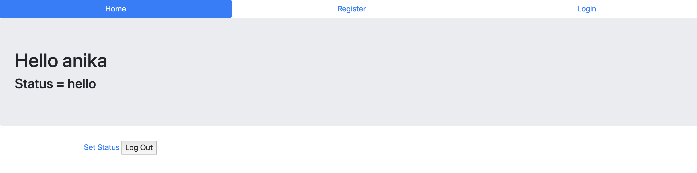

# Smokey

A basic registration form demonstrating skill in Flask, Mongo DB, HTML, and Bootstrap. 

## Usage 

The final webpage is deployed at [Link](http://smokeywizard.herokuapp.com). When you first open the link, you will be led to the login page. You may click "Register" if you are a first time user. **Register using a fake name, email, and password.** Once you register, you will be led back to the login page to login. Once you login, the home page will be opened. You will be greeted and, at the bottom, you can click a link to set a status. 

## Visuals

## Architecture

Frontend: HTML, Bootstrap
Backend: Python, Flask, Mongo DB
